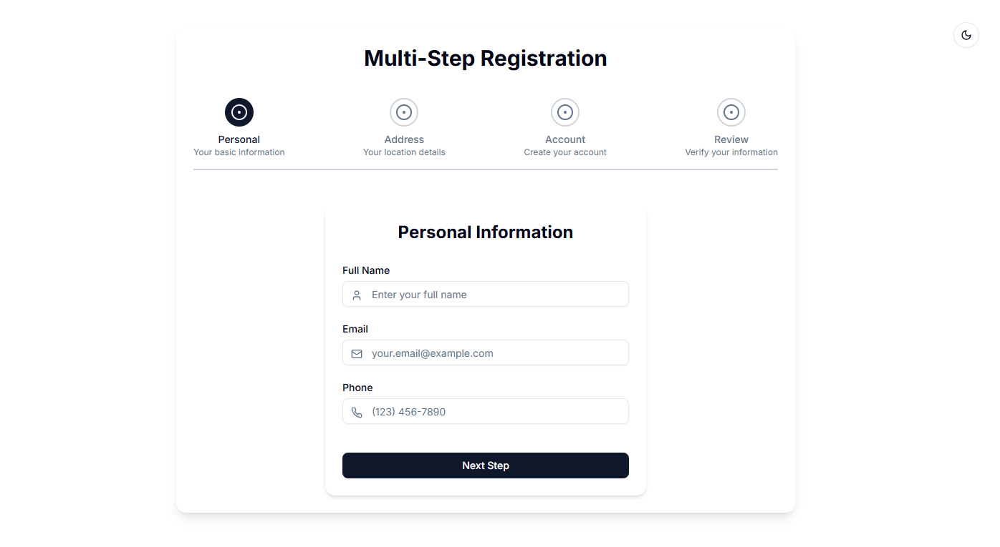

You can update the "Screenshots" section in the `README.md` file to include the image from your `public` folder. Here's the updated version of the file:

```markdown
# Multi-Step Form with Dark Mode Toggle

This project is a multi-step form built using **React**, **Next.js**, **Tailwind CSS**, and **next-themes** for dark mode support. It includes basic form fields, step navigation, and theme toggling functionality.

## Features

- Multi-step form with validation
- Dark mode toggle using **next-themes**
- Responsive design with **Tailwind CSS**
- Smooth transitions between form steps
- Form data persistence across steps

## Technologies Used

- **React**: JavaScript library for building the user interface.
- **Next.js**: React framework for server-side rendering.
- **Tailwind CSS**: Utility-first CSS framework for styling.
- **Lucide**: Icons for the UI components.
- **next-themes**: To handle dark mode and theme switching.

## Installation

Follow these steps to get your project up and running:

### 1. Navigate to the project directory

```bash
cd <project-folder>
```

### 2. Install the dependencies

```bash
npm install
```

### 3. Run the development server

```bash
npm run dev
```

### 4. Open your browser

Go to `http://localhost:3000` to view the app.

## Usage

- **Dark Mode Toggle**: You can toggle between light and dark modes by clicking the button at the top-right corner of the page.
- **Multi-Step Form**: The form progresses through multiple steps. Click **Next** to move to the next step and **Back** to return to the previous step.

## Screenshots



## License

This project is licensed under the MIT License.
```
